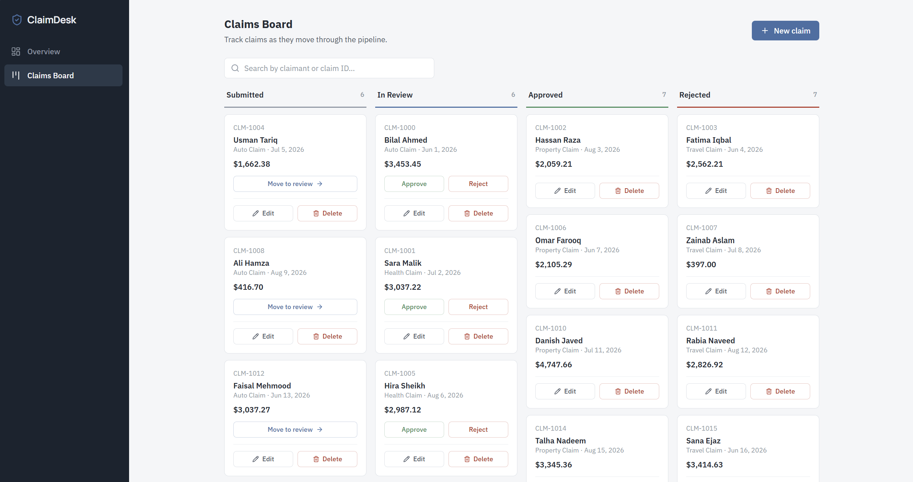

# ClaimDesk — Insurance Claims Dashboard


A production-style claims-processing dashboard for insurance adjusters.
Claims move through a Kanban pipeline — **Submitted → In Review → Approved /
Rejected** — with a KPI overview dashboard, per-claim detail views, full
CRUD, and an AI assistant that polishes rough incident notes into clear,
professional claim descriptions.

Built as a portfolio project to demonstrate the case-management pattern
common to insurance and enterprise software. No external backend is
required to run it — the app works out of the box with mocked in-memory
data.


> **Screenshot** — add a screenshot of the claims board here before pushing,
> it makes the project far more approachable for reviewers:
> ```md
> 
> ```
> (Capture at `http://localhost:5173/claims`, save the image in a `docs/`
> folder, and commit it.)

---

## Table of contents

- [Features](#features)
- [Tech stack](#tech-stack)
- [Getting started](#getting-started)
- [AI feature setup](#ai-feature-setup)
- [Build & deploy](#build--deploy)
- [Project structure](#project-structure)
- [Scope & limitations](#scope--limitations)
- [Roadmap](#roadmap)

## Features

**Core functionality**

- **Overview dashboard** — KPI cards (total, awaiting decision, approved, total payout), a claims-by-status pie chart, and a sortable recent-claims list, with skeleton loading states
- **Claims board** — a Kanban-style pipeline; move a claim to review, then approve or reject it, directly from the board
- **Claim detail** — full claim info (policy number, requested/approved amounts, dates) with the same workflow actions
- **Full CRUD** — create claims via a form, **edit** them through a modal, and **delete** them with a confirmation prompt
- **Sorting & search** — dashboard sorting by date or amount, and board search by claimant name or claim ID

**AI-powered assistant**

- **"✨ Polish with AI"** — rewrites a rough incident note into a clear, professional claim description via Google's Gemini API. The API key stays server-side — never bundled into the browser. Works both locally and when deployed, see [AI feature setup](#ai-feature-setup).

**Engineering choices**

- **State management with Context API + `useReducer`** — typed action unions keep all status transitions and CRUD operations in one predictable place
- **Purposeful optimization** — `useMemo` for derived data (board columns, dashboard breakdown, sorted lists) and route-level code splitting with `React.lazy`
- **Fully responsive** — the sidebar collapses into a slide-out mobile drawer below the `sm` breakpoint
- **Honest error handling** — async failures (including a missing API key) surface as friendly inline messages instead of breaking the app

## Tech stack

React 19 · TypeScript (strict) · Vite · Tailwind CSS · Context API + useReducer ·
React Router · Recharts · Lucide icons · Google Gemini API (Vite middleware locally, Vercel serverless function in production)

## Getting started

```bash
npm install
npm run dev
```

The app runs at `http://localhost:5173`. Sign in with any email/password —
this is a demo build with an in-memory login (see [Scope & limitations](#scope--limitations)).

No environment variables are needed to run the app itself — only the
optional AI feature needs a key, below.

## AI feature setup

The "Polish with AI" button calls `/api/polish-claim-description`, which
forwards your note to Google's Gemini API and returns a polished version.
The endpoint is served by **the same handler in both environments**
(`server/polish-claim.ts`):

- **Locally** — a middleware in `vite.config.ts` serves it from the Vite dev/preview server
- **Deployed** — Vercel auto-detects `api/polish-claim-description.ts` as a serverless function

Gemini was chosen because its free tier requires **no credit card, ever**.

**To enable it locally:**

1. Get a free key at [aistudio.google.com/apikey](https://aistudio.google.com/apikey)
2. `cp .env.example .env.local` and paste your key into `.env.local`
3. `npm run dev` — done; no Vercel CLI needed

**To enable it on Vercel:**

1. Add `GEMINI_API_KEY` in **Settings → Environment Variables**
2. Redeploy

**Without a key configured**, everything else works normally — the button
just shows a friendly message saying it isn't set up yet.

**Model lifecycle note:** the endpoint defaults to `gemini-3.5-flash`, and
Google retires Flash models regularly (2.0 Flash was shut down June 1, 2026;
2.5 Flash follows in late 2026). If the button reports "temporarily
unavailable," check the dev-server / function logs and repoint
`GEMINI_MODEL` in your env vars. See
[ai.google.dev/gemini-api/docs/deprecations](https://ai.google.dev/gemini-api/docs/deprecations).

## Build & deploy

```bash
npm run build    # type-check (tsc) + production build
npm run preview  # preview the production build locally
npm run lint     # oxlint
```

**Deploying to Vercel:**

1. Push this repo to GitHub.
2. Import it at [vercel.com/new](https://vercel.com/new).
3. Vercel auto-detects the Vite preset and the `/api` function — no configuration needed.
4. (Optional) Add `GEMINI_API_KEY` under Environment Variables to enable the AI feature.
5. Deploy.

## Project structure

```javascript
api/
  polish-claim-description.ts  Vercel serverless function — thin adapter for deployment
server/
  polish-claim.ts              shared AI-endpoint handler (Vite middleware + Vercel function)
src/
  components/ shared UI (Layout, StatusBadge, ProtectedRoute, EditClaimModal)
  context/    AuthContext + ClaimsContext (useReducer-based state, all CRUD + transitions)
  data/       mock claims data
  pages/      route-level pages (Dashboard, ClaimsBoard, ClaimDetail, Login)
  types/      shared TypeScript types
  utils/      formatting helpers
```

## Scope & limitations

This is a front-end-focused demo, and it's worth being precise about what
that means:

- **Data is mocked and held in memory** — no real policyholder data, no
backend, no database. The API layer is simulated so the
claims/case-management UX is the star.
- **Login is not real authentication** — any email/password combination is
accepted. A production build would use a real auth provider plus protected
API routes.
- **The AI endpoint relies on Gemini's free tier**, which has rate limits
and a moving model lifecycle (see the note above).

These boundaries were deliberate: they keep the project runnable by anyone
in under a minute while demonstrating the full UI, state, and integration
patterns. See the roadmap for how each would be addressed in production.